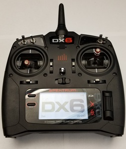
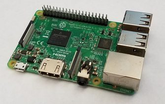
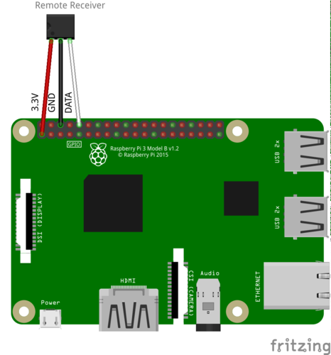

# remote_receiver_tutorial

This tutorial demonstrates interfacing a radio transmitter and receiver with a
Raspberry Pi over the Spektrum remote receiver (aka Spektrum satellite)
protocol.

## You will need
* A radio transmitter: I used the Spektrum DX6 transmitter but others should
work too

* A radio receiver: I used a Spektrum AR7700 and a Spektrum DSMX remote
receiver, but you only need one that is compatible with
your transmitter and has a Spektrum remote receiver protocol output. I assume
that your transmitter and receiver have already been bound. Instructions
for binding transmitters and receivers should be found with the manufacturer.

Example receivers capable of communicating over the remote receiver serial
protocol: AR7700 (left) and DSMX remote receiver(right)

* A Raspberry Pi: I used a Raspberry Pi 3 with Raspbian Stretch installed.
It may actually be easier to interface with older Raspberry Pis and OS 
distributions because of how Raspberry Pi's now handle their UART ports.

* (optional) A flight control board: If you want to send rc signals to a flight
control board capable of handling the remote receiver protocol. I used an
Omnibus F3 Pro.

## Hardware wiring
* Connect the receiver's ground to the Raspberry Pi ground.
* Connect the receiver's power to the appropriate Raspberry Pi power
pin. For example, the AR7700, connect the Raspberry Pi's 5V output to the
AR7700 5V rail, and for the Spektrum Remote Receiver unit, connect the
Raspberry Pi's 3.3V output to the receiver's 3.3V line)
* Connect the receiver's signal line to the Raspberry Pi RXD UART GPIO pin
(GPIO 15 / pin 10 on the Raspberry Pi 3)

Diagram of a remote receiver connected to the Raspberry Pi. Note if your
receiver uses 3.3V or 5V input power.

* (optional) Connect the Raspberry Pi's TXD UART GPIO pin (GPIO 14 / pin 8 on
the Raspberry Pi 3) to the flight control board.

## Raspberry Pi configuration
The UART ports on the Raspberry Pi 3 have a rather complicated setup.
There are two UART ports, `/dev/ttyAMA0` and `/dev/ttyS0`. 
The `/dev/ttyAMA0` port we want to use with the UART pins is used for 
bluetooth communication by default, so we'll either have to move the port used
by bluetooth or disable bluetooth altogether.
To move bluetooth, add
`dtoverlay=pi3-miniuart-bt` to the Pi's `/boot/config.txt`
To disable blutooth, add
`dtoverlay=pi3-disable-bt` to the Pi's `/boot/config.txt`
I'd recommend disabling bluetooth to keep life simple.

## Run the code
Power the transmitter on and run `python main.py` on the Raspberry Pi. The code
should output the values received from the transmitter. Toggle the transmitter
power and see that the signals received stop and start with the transmitter
power.

## Background
I wanted to put a Raspberry Pi on a quadcopter, so I needed to find a way to
connect the Pi to the radio receiver used to receive control signals from the
transmitter on the ground. It's a mess out there with receiver protocols. There
are a lot of them and they aren't all so well documented.

First I had a receiver outputting PWM signals. PWM signals are product of the
days of DC motors and simple servos and not great for interfacing with a
Raspberry Pi.
